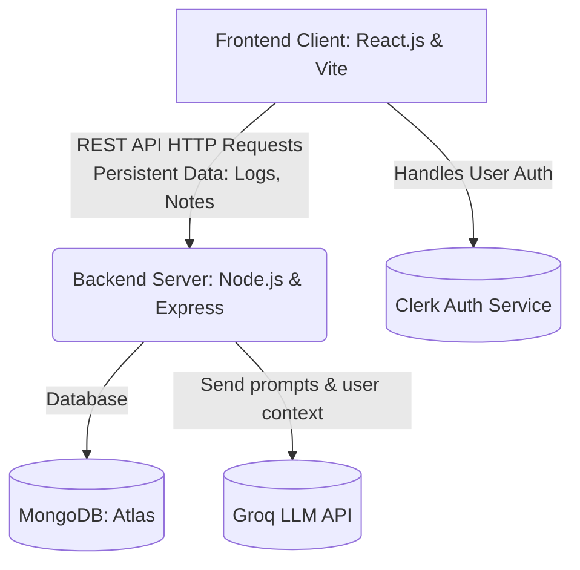

# 1.1 Purpose
The purpose of "AI Study Buddy" is to provide a comprehensive, AI-driven study platform that optimizes learning retention through smart scheduling, automatic summarization, and an immersive focus environment.

# 1.2 Functional Requirements
* **User Authentication**: The system must allow users to register, log in, and manage their profiles securely using the Clerk API.
* **AI Study Chat**: The system must provide a RAG (Retrieval-Augmented Generation) based chat interface to answer questions based on the user's specific notes.
* **Content Summarization**: The system must instantly generate concise text summaries from large inputs using the Groq API.
* **Smart Quiz Generation**: The system must automatically generate revision questions to test user knowledge sequentially.
* **Study Activity Tracking**: The system must allow users to log study sessions and track them on a visual calendar contribution graph.
* **Spaced Repetition**: The system must use confidence-based metrics to suggest optimal revision dates for topics.
* **Focus Environments**: The system must provide "Zen Mode" and "Focus Mode" featuring full-screen interactive clocks and minimal visual distractions.

# 1.3 Non-Functional Requirements
* **Performance**: System APIs must respond quickly, facilitated by optimized database queries for dashboard data aggregation.
* **Usability**: The UI must be highly responsive with modern "Bento Grid" styles, dark mode, and smooth Framer Motion animations.
* **Security**: External API keys (Groq, Clerk) and DB URIs must be secured via server-side environment variables (.env).

# Part 2: System Architecture Design
Use this diagram to demonstrate the Accuracy of Design (Parameter B) in your presentation slides.

**High-Level Architecture Flowchart**
Your project follows a powerful decoupled Client-Server model.

> **TIP:** You can take a screenshot of the diagram above directly from the UI and paste it straight onto your presentation slide! It clearly shows the examiners that you know how APIs and Services communicate.

# Part 3: Presentation Outline & Script
Use this to divide the workload for Individual Contribution (Parameter D) and to practice your Presentation Skills (Parameter C).

*(Assuming a 4-person team. Adjust as needed!)*

## Slide 1: Title Slide (Speaker 1)
* **Content:** Project Title, Group Mates' Names, Supervisor's Name.
* **Script:** "Good morning respected teachers. We are Group [Number], and today we are absolutely thrilled to present our Project-1: AI Study Buddy, a platform engineered to revolutionize how students learn and retain information."

## Slide 2: Problem Statement (Speaker 1)
* **Content:** Information overload, lack of structured revision, poor focus.
* **Script:** "Students today face three major problems: spending too much time reading massive blocks of text, forgetting what they learned due to poor revision strategies, and constantly losing focus while studying. We built AI Study Buddy to solve exactly these issues."

## Slide 3: Live Demo & Key Features (Speaker 2)
* **Content:** Show screenshots or do a live walkthrough of the Pro Dashboard, Bento Grid, and the Zen Mode.
* **Script:** "Instead of just talking about it, let me show you. Here is our Bento Grid dashboard tracking user streaks and statistics. Notice how we integrated specialized focus tools like Zen Mode to help students stay in the flow without distractions."

## Slide 4: AI Core Logic & SRS (Speaker 3)
* **Content:** Explain the RAG Chat, Auto-Summarization, and Quiz generation.
* **Script:** "Our core functional requirement was deep AI integration. We implemented a Retrieval-Augmented Generation (RAG) chat that doesn't just guess answers, but responds strictly based on the user's uploaded context. We also successfully built auto-summarization and a smart quiz generator to test knowledge."

## Slide 5: System Architecture & Technologies Used (Speaker 4)
* **Content:** Show the Architecture Flowchart. Mention MERN, Clerk, Groq.
* **Script:** "To achieve this seamlessly, we utilized an optimized MERN stack. Our front end uses React and Vite. Our backend is Node and Express connected to MongoDB. Finally, we utilized the Groq API because its inference speed is exponentially faster than standard OpenAI models."

## Slide 6: Conclusion (Speaker 1)
* **Content:** Summary of completion mapping to the initial plan.
* **Script:** "In conclusion, we have successfully completed all planned milestones according to our initial project abstract. Our application is fully functional, secure, modern, and production-ready. Thank you for your time and guidance, we are now open to any questions!"
